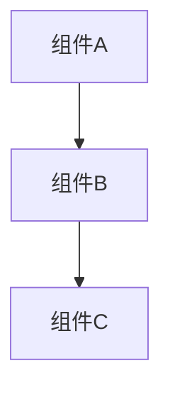

# 文档整合与管理指南

## 概述

本项目的文档管理采用了双目录策略：
- `Back-end/docs` - 后端项目内的文档，包含所有技术文档的主要版本
- `/docs` - 根目录文档，作为整个项目的文档中心，包含后端、前端和系统整体的文档

为保持两个目录的文档同步，我们提供了自动复制脚本。

## 文档结构

文档按以下类别组织：

```
docs/
├── README.md                # 文档索引
├── architecture/            # 系统架构文档
│   ├── System_Architecture_Overview.md
│   ├── Database_ER_Diagram.md
│   ├── Frontend_Sequence_Diagram.md
│   └── Admin_Sequence_Diagram.md
├── backend/                 # 后端开发文档
│   ├── Backend_Overview.md
│   ├── API_Documentation.md
│   └── ...
├── frontend/                # 前端开发文档
├── admin/                   # 管理后台文档
├── standards/               # 编码规范文档
└── optimization/            # 性能优化文档
```

## 文档管理流程

### 1. 创建或修改文档

在后端项目的文档目录创建或修改文档：

```
Back-end/docs/...
```

### 2. 同步到根目录

运行复制脚本将文档同步到根目录：

```bash
# 在后端项目目录下运行
npm run docs:copy
```

这个命令会将`Back-end/docs`目录中的所有文档复制到根目录的`/docs`文件夹中。

### 3. 提交变更

提交所有文档变更：

```bash
git add Back-end/docs/
git add docs/
git commit -m "更新文档: xxx"
```

## 文档编写规范

1. 使用Markdown格式编写所有文档
2. 文件名使用英文，使用下划线分隔单词
3. 图表使用Mermaid语法
4. 代码示例需包含语言标识
5. 中英文混排时使用空格分隔

## 图表生成

文档中的图表使用Mermaid语法，示例：

````markdown

````

## 注意事项

1. 所有重要文档都应该先在后端目录创建，然后复制到根目录
2. 不要直接在根目录修改文档，这会导致后端目录的文档不同步
3. 定期运行复制脚本，确保文档保持同步
4. 文档更新应该包含在相关功能的提交中 