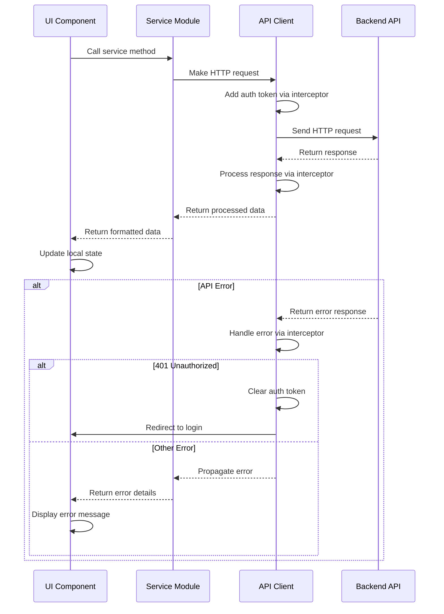
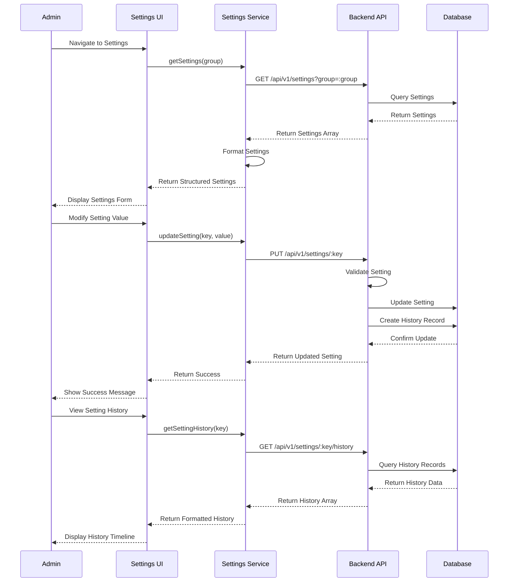
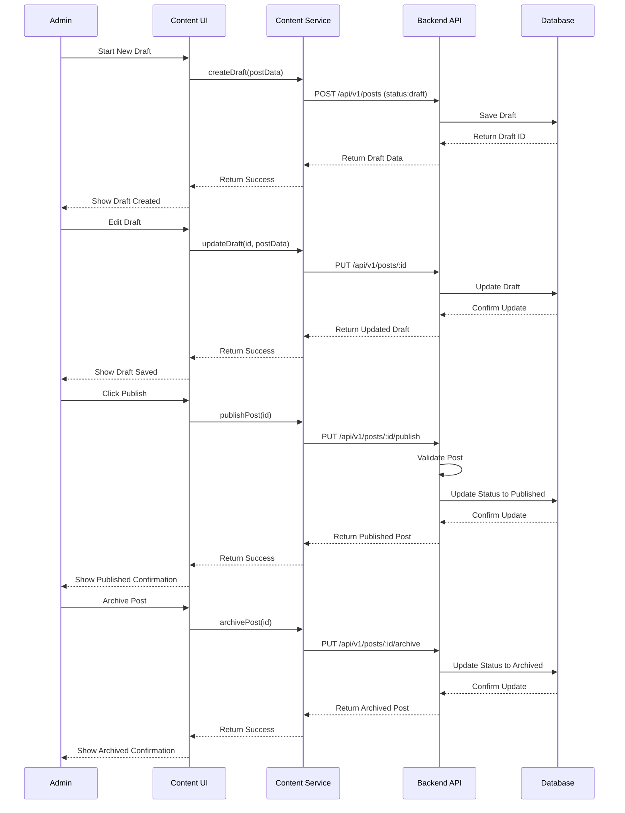

# 管理后台交互序列图

本文档描述了管理后台的主要交互流程，包括用户认证、内容管理、媒体管理和系统设置等功能的数据流向。

## 管理员操作流程

以下序列图展示了管理员操作的主要流程，包括登录认证、文章管理、媒体管理、分类和标签管理以及系统设置等功能。

```mermaid
sequenceDiagram
    participant Admin
    participant AdminPanel
    participant Backend
    participant Database

    %% Authentication Flow
    Admin->>AdminPanel: Enter Login Credentials
    AdminPanel->>Backend: POST /api/v1/auth/login
    Backend->>Database: Verify Admin Credentials
    Database-->>Backend: Return Admin Data
    Backend->>Backend: Generate JWT Token
    Backend-->>AdminPanel: Return Token & Admin Info
    AdminPanel->>AdminPanel: Store Token in Local Storage
    AdminPanel-->>Admin: Show Dashboard

    %% Post Management Flow
    alt Create New Post
        Admin->>AdminPanel: Click "Create Post"
        AdminPanel->>AdminPanel: Show Post Editor
        Admin->>AdminPanel: Fill Post Details
        AdminPanel->>Backend: POST /api/v1/posts (with JWT)
        Backend->>Backend: Validate Token & Permissions
        Backend->>Database: Save Post
        Database-->>Backend: Confirm Save
        Backend-->>AdminPanel: Return Success
        AdminPanel-->>Admin: Show Success Message
    end

    alt Edit Post
        Admin->>AdminPanel: Select Post to Edit
        AdminPanel->>Backend: GET /api/v1/posts/:id (with JWT)
        Backend->>Database: Fetch Post
        Database-->>Backend: Return Post Data
        Backend-->>AdminPanel: Return Post
        AdminPanel->>AdminPanel: Show Edit Form
        Admin->>AdminPanel: Modify Post
        AdminPanel->>Backend: PUT /api/v1/posts/:id (with JWT)
        Backend->>Database: Update Post
        Database-->>Backend: Confirm Update
        Backend-->>AdminPanel: Return Success
        AdminPanel-->>Admin: Show Success Message
    end

    %% Media Management Flow
    alt Upload Media
        Admin->>AdminPanel: Click "Upload Media"
        AdminPanel->>AdminPanel: Show Upload Dialog
        Admin->>AdminPanel: Select File
        AdminPanel->>Backend: POST /api/v1/media (with JWT)
        Backend->>Backend: Validate File
        Backend->>Database: Save Media Record
        Database-->>Backend: Confirm Save
        Backend->>FileSystem: Save File
        FileSystem-->>Backend: Confirm Save
        Backend-->>AdminPanel: Return Media Info
        AdminPanel-->>Admin: Show Upload Success
    end

    %% Category & Tag Management
    alt Manage Categories
        Admin->>AdminPanel: Navigate to Categories
        AdminPanel->>Backend: GET /api/v1/categories (with JWT)
        Backend->>Database: Fetch Categories
        Database-->>Backend: Return Categories
        Backend-->>AdminPanel: Return Category List
        AdminPanel-->>Admin: Display Categories
    end

    alt Manage Tags
        Admin->>AdminPanel: Navigate to Tags
        AdminPanel->>Backend: GET /api/v1/tags (with JWT)
        Backend->>Database: Fetch Tags
        Database-->>Backend: Return Tags
        Backend-->>AdminPanel: Return Tag List
        AdminPanel-->>Admin: Display Tags
    end

    %% System Settings
    alt Update Settings
        Admin->>AdminPanel: Navigate to Settings
        AdminPanel->>Backend: GET /api/v1/settings (with JWT)
        Backend->>Database: Fetch Settings
        Database-->>Backend: Return Settings
        Backend-->>AdminPanel: Return Settings
        Admin->>AdminPanel: Modify Settings
        AdminPanel->>Backend: PUT /api/v1/settings (with JWT)
        Backend->>Database: Update Settings
        Database-->>Backend: Confirm Update
        Backend-->>AdminPanel: Return Success
        AdminPanel-->>Admin: Show Update Success
    end
```

## 管理后台服务层交互

下面的序列图展示了管理后台UI组件、服务层和后端API之间的交互流程，包括正常请求流程和错误处理流程。

## 设置系统交互流程

以下序列图展示了设置系统的交互流程，包括设置的读取、更新和历史记录。

## 内容管理工作流

下面的序列图展示了内容管理的工作流，包括草稿、发布和归档状态的文章处理。

