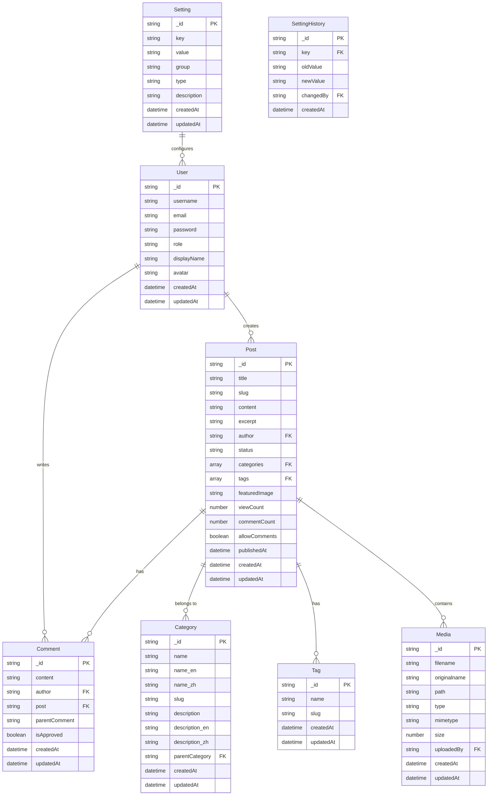

# 数据库 ER 图

本文档描述了个人博客系统的数据库实体关系图，展示了各实体之间的关系和字段结构。

## ER 图

## 实体说明

### 用户 (User)

用户表存储系统中的所有用户信息，包括管理员和普通用户。

| 字段 | 类型 | 描述 |
|------|------|------|
| _id | ObjectId | 唯一标识符 |
| username | String | 用户名，唯一 |
| email | String | 电子邮件，唯一 |
| password | String | 加密密码 |
| role | String | 用户角色（admin/author/user） |
| displayName | String | 显示名称 |
| avatar | String | 头像URL |
| createdAt | Date | 创建时间 |
| updatedAt | Date | 更新时间 |

### 文章 (Post)

文章表存储博客的所有文章。

| 字段 | 类型 | 描述 |
|------|------|------|
| _id | ObjectId | 唯一标识符 |
| title | String | 文章标题 |
| slug | String | URL友好的标识，唯一 |
| content | String | 文章内容（Markdown） |
| excerpt | String | 文章摘要 |
| author | ObjectId | 引用User |
| status | String | 状态（draft/published/archived） |
| categories | [ObjectId] | 引用Category数组 |
| tags | [ObjectId] | 引用Tag数组 |
| featuredImage | String | 特色图片URL |
| viewCount | Number | 浏览次数 |
| commentCount | Number | 评论数量 |
| allowComments | Boolean | 是否允许评论 |
| publishedAt | Date | 发布时间 |
| createdAt | Date | 创建时间 |
| updatedAt | Date | 更新时间 |

### 评论 (Comment)

评论表存储文章的评论信息。

| 字段 | 类型 | 描述 |
|------|------|------|
| _id | ObjectId | 唯一标识符 |
| content | String | 评论内容 |
| author | ObjectId | 引用User |
| post | ObjectId | 引用Post |
| parentComment | ObjectId | 引用Comment（回复） |
| isApproved | Boolean | 是否审核通过 |
| createdAt | Date | 创建时间 |
| updatedAt | Date | 更新时间 |

### 分类 (Category)

分类表存储博客的文章分类。

| 字段 | 类型 | 描述 |
|------|------|------|
| _id | ObjectId | 唯一标识符 |
| name | String | 分类名称 |
| name_en | String | 英文分类名称 |
| name_zh | String | 中文分类名称 |
| slug | String | URL友好的标识，唯一 |
| description | String | 分类描述 |
| description_en | String | 英文分类描述 |
| description_zh | String | 中文分类描述 |
| parentCategory | ObjectId | 引用Category（父分类） |
| createdAt | Date | 创建时间 |
| updatedAt | Date | 更新时间 |

### 标签 (Tag)

标签表存储博客的文章标签。

| 字段 | 类型 | 描述 |
|------|------|------|
| _id | ObjectId | 唯一标识符 |
| name | String | 标签名称 |
| slug | String | URL友好的标识，唯一 |
| createdAt | Date | 创建时间 |
| updatedAt | Date | 更新时间 |

### 媒体 (Media)

媒体表存储上传的图片和文件。

| 字段 | 类型 | 描述 |
|------|------|------|
| _id | ObjectId | 唯一标识符 |
| filename | String | 保存的文件名 |
| originalname | String | 原始文件名 |
| path | String | 文件路径 |
| type | String | 文件类型（image/document/etc） |
| mimetype | String | MIME类型 |
| size | Number | 文件大小（字节） |
| uploadedBy | ObjectId | 引用User |
| createdAt | Date | 创建时间 |
| updatedAt | Date | 更新时间 |

### 设置 (Setting)

设置表存储系统配置信息。

| 字段 | 类型 | 描述 |
|------|------|------|
| _id | ObjectId | 唯一标识符 |
| key | String | 设置键名，唯一 |
| value | String | 设置值 |
| group | String | 设置分组 |
| type | String | 值类型（string/number/boolean/json） |
| description | String | 设置描述 |
| createdAt | Date | 创建时间 |
| updatedAt | Date | 更新时间 |

### 设置历史 (SettingHistory)

设置历史表记录设置的变更历史。

| 字段 | 类型 | 描述 |
|------|------|------|
| _id | ObjectId | 唯一标识符 |
| key | String | 设置键名 |
| oldValue | String | 旧值 |
| newValue | String | 新值 |
| changedBy | ObjectId | 引用User |
| createdAt | Date | 创建时间 |

## 索引策略

为优化数据库性能，系统为以下字段创建了索引：

- User: `username`, `email`
- Post: `slug`, `author`, `status`, `categories`, `tags`, `publishedAt`, `viewCount`
- Category: `slug`, `parentCategory`
- Tag: `slug`
- Comment: `post`, `author`, `parentComment`
- Media: `type`, `uploadedBy`
- Setting: `key`, `group`

## 数据库优化

为提高查询效率，实施了以下优化：

1. 使用`lean()`查询减少文档水合的开销
2. 投影查询只返回必要字段
3. 复合索引支持常见查询模式
4. 文本索引支持全文搜索
5. 查询监控中间件识别慢查询 