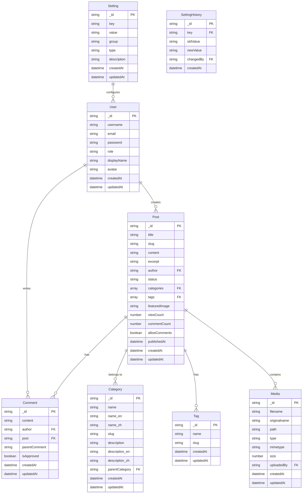

# Database ER Diagram

This document describes the Entity-Relationship diagram of the personal blog system, showing the relationships between entities and their field structures.

## ER Diagram

## Entity Descriptions

### User

The User table stores all user information in the system, including administrators and regular users.

| Field | Type | Description |
|-------|------|-------------|
| _id | ObjectId | Unique identifier |
| username | String | Username, unique |
| email | String | Email address, unique |
| password | String | Encrypted password |
| role | String | User role (admin/author/user) |
| displayName | String | Display name |
| avatar | String | Avatar URL |
| createdAt | Date | Creation time |
| updatedAt | Date | Update time |

### Post

The Post table stores all blog articles.

| Field | Type | Description |
|-------|------|-------------|
| _id | ObjectId | Unique identifier |
| title | String | Article title |
| slug | String | URL-friendly identifier, unique |
| content | String | Article content (Markdown) |
| excerpt | String | Article excerpt |
| author | ObjectId | References User |
| status | String | Status (draft/published/archived) |
| categories | [ObjectId] | References Category array |
| tags | [ObjectId] | References Tag array |
| featuredImage | String | Featured image URL |
| viewCount | Number | View count |
| commentCount | Number | Comment count |
| allowComments | Boolean | Whether comments are allowed |
| publishedAt | Date | Publication time |
| createdAt | Date | Creation time |
| updatedAt | Date | Update time |

### Comment

The Comment table stores article comments.

| Field | Type | Description |
|-------|------|-------------|
| _id | ObjectId | Unique identifier |
| content | String | Comment content |
| author | ObjectId | References User |
| post | ObjectId | References Post |
| parentComment | ObjectId | References Comment (reply) |
| isApproved | Boolean | Whether approved |
| createdAt | Date | Creation time |
| updatedAt | Date | Update time |

### Category

The Category table stores blog article categories.

| Field | Type | Description |
|-------|------|-------------|
| _id | ObjectId | Unique identifier |
| name | String | Category name |
| name_en | String | English category name |
| name_zh | String | Chinese category name |
| slug | String | URL-friendly identifier, unique |
| description | String | Category description |
| description_en | String | English category description |
| description_zh | String | Chinese category description |
| parentCategory | ObjectId | References Category (parent) |
| createdAt | Date | Creation time |
| updatedAt | Date | Update time |

### Tag

The Tag table stores blog article tags.

| Field | Type | Description |
|-------|------|-------------|
| _id | ObjectId | Unique identifier |
| name | String | Tag name |
| slug | String | URL-friendly identifier, unique |
| createdAt | Date | Creation time |
| updatedAt | Date | Update time |

### Media

The Media table stores uploaded images and files.

| Field | Type | Description |
|-------|------|-------------|
| _id | ObjectId | Unique identifier |
| filename | String | Saved filename |
| originalname | String | Original filename |
| path | String | File path |
| type | String | File type (image/document/etc) |
| mimetype | String | MIME type |
| size | Number | File size (bytes) |
| uploadedBy | ObjectId | References User |
| createdAt | Date | Creation time |
| updatedAt | Date | Update time |

### Setting

The Setting table stores system configuration information.

| Field | Type | Description |
|-------|------|-------------|
| _id | ObjectId | Unique identifier |
| key | String | Setting key, unique |
| value | String | Setting value |
| group | String | Setting group |
| type | String | Value type (string/number/boolean/json) |
| description | String | Setting description |
| createdAt | Date | Creation time |
| updatedAt | Date | Update time |

### SettingHistory

The SettingHistory table records setting change history.

| Field | Type | Description |
|-------|------|-------------|
| _id | ObjectId | Unique identifier |
| key | String | Setting key |
| oldValue | String | Old value |
| newValue | String | New value |
| changedBy | ObjectId | References User |
| createdAt | Date | Creation time |

## Indexing Strategy

To optimize database performance, the system creates indexes for the following fields:

- User: `username`, `email`
- Post: `slug`, `author`, `status`
- Category: `slug`, `parentCategory`
- Tag: `slug`
- Media: `uploadedBy`, `type`
- Setting: `key`, `group`
- SettingHistory: `key`, `changedBy`

## Relationships

1. **User-Post**: One-to-Many
   - A user can create multiple posts
   - Each post belongs to one user

2. **User-Comment**: One-to-Many
   - A user can write multiple comments
   - Each comment belongs to one user

3. **Post-Comment**: One-to-Many
   - A post can have multiple comments
   - Each comment belongs to one post

4. **Post-Category**: Many-to-Many
   - A post can belong to multiple categories
   - A category can contain multiple posts

5. **Post-Tag**: Many-to-Many
   - A post can have multiple tags
   - A tag can be used in multiple posts

6. **Post-Media**: One-to-Many
   - A post can contain multiple media files
   - Each media file belongs to one post

7. **Category-Category**: Self-Referential
   - A category can have a parent category
   - A category can have multiple child categories

8. **Setting-User**: One-to-Many
   - A user can change multiple settings
   - Each setting change is recorded with the user who made it 