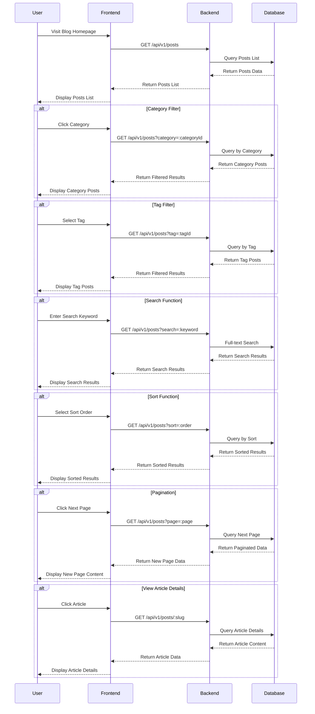
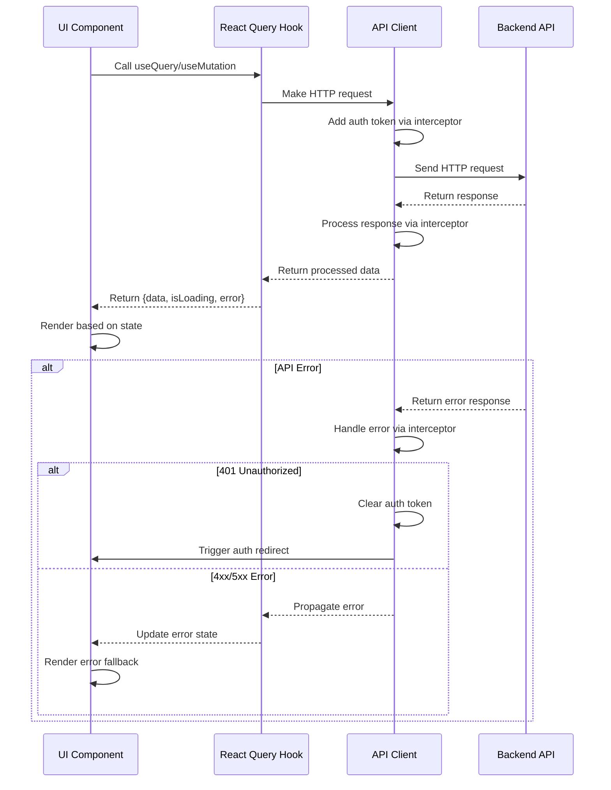
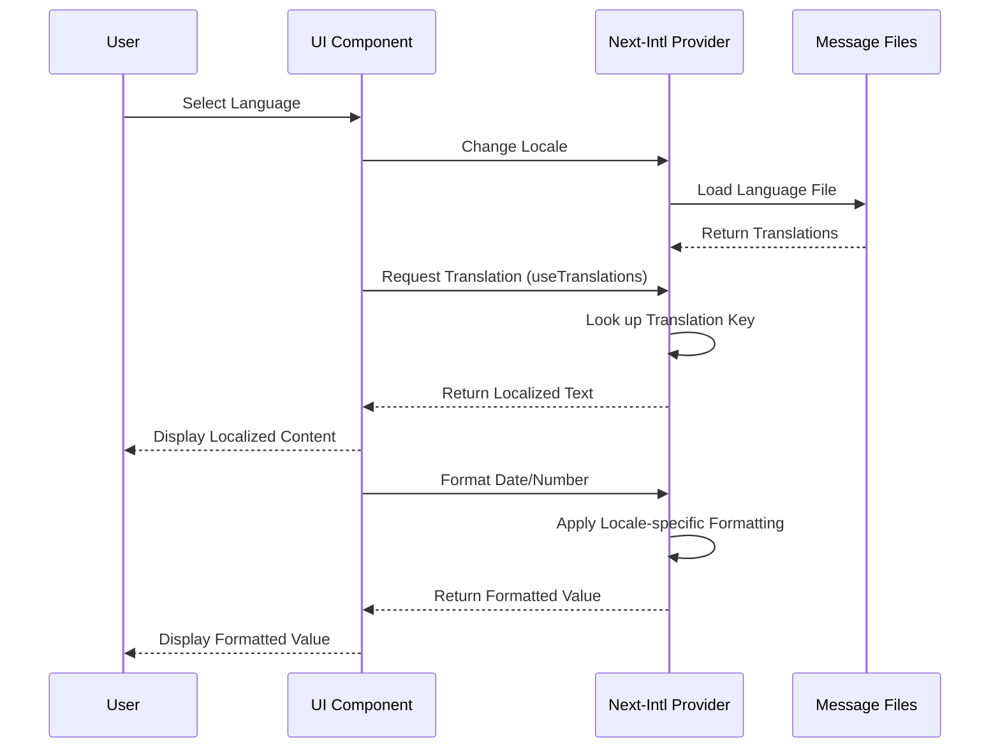
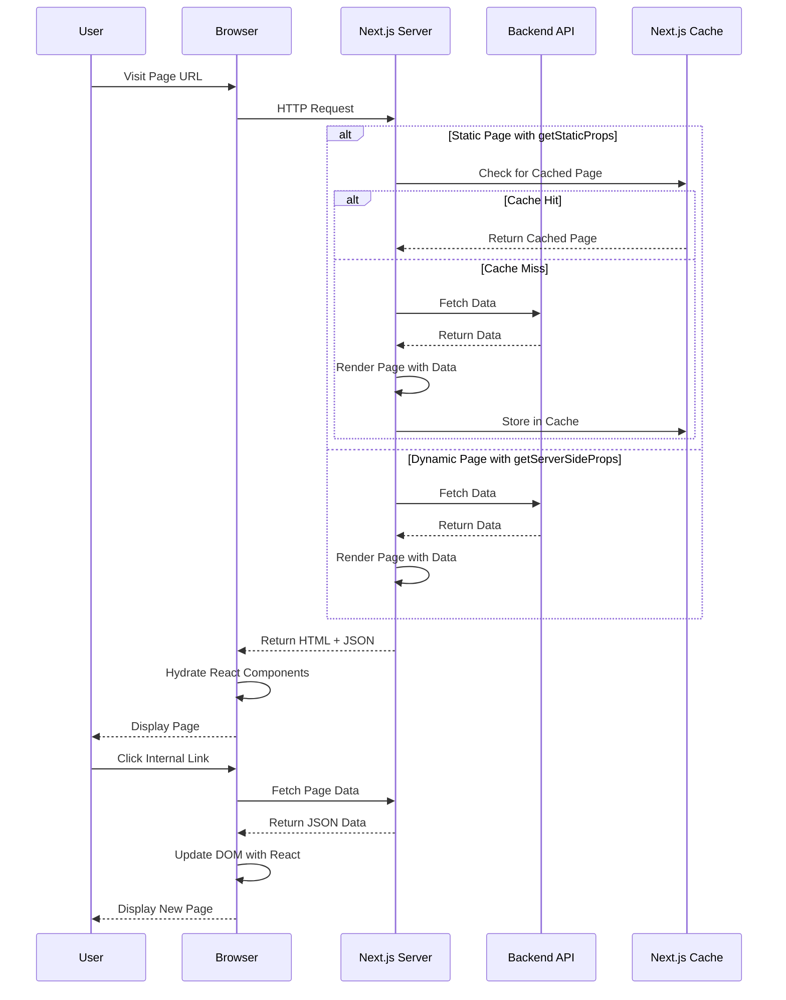
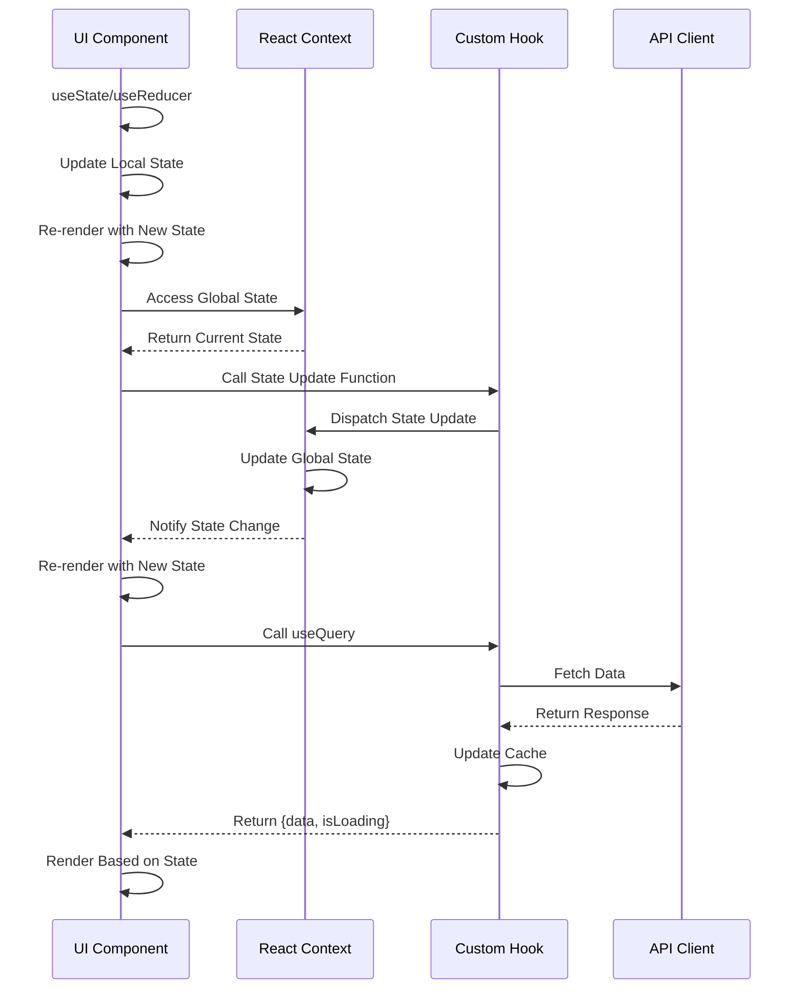

# 前端交互序列图

本文档描述了前端用户交互的主要流程和数据流向，使用序列图展示用户、前端界面、后端API和数据库之间的交互过程。

## 用户浏览流程

以下序列图展示了用户浏览博客内容的主要流程，包括查看文章列表、筛选、搜索和阅读文章详情。

## 前端数据处理流程

下面的序列图展示了前端组件、服务层和后端API之间的数据处理流程，包括正常请求流程和错误处理流程。

## 前端国际化流程

以下序列图展示了前端国际化处理流程，包括语言切换和本地化内容渲染。

## 前端渲染流程

下面的序列图展示了Next.js前端的服务端渲染和客户端渲染流程。

## 前端状态管理流程

以下序列图展示了前端状态管理的流程，包括全局状态和本地状态。

