```mermaid
graph TB
    subgraph Frontend
        NextJS[Next.js Frontend]
        Static[Static Assets]
        I18n[Internationalization]
        UI[UI Components]
    end

    subgraph AdminPanel
        React[React Admin Panel]
        Auth[Admin Auth]
        Dashboard[Dashboard]
        CMS[Content Management]
        MediaMgr[Media Management]
        
        subgraph ServiceLayer[API Service Layer]
            APIClient[API Client]
            AuthService[Auth Service]
            PostService[Post Service]
            CategoryService[Category Service]
            TagService[Tag Service]
            MediaService[Media Service]
            SettingService[Setting Service]
            
            APIClient --> AuthService
            APIClient --> PostService
            APIClient --> CategoryService
            APIClient --> TagService
            APIClient --> MediaService
            APIClient --> SettingService
        end
        
        Dashboard --> ServiceLayer
        CMS --> ServiceLayer
        MediaMgr --> ServiceLayer
        Auth --> AuthService
    end

    subgraph Backend
        Express[Express Server]
        Auth[Authentication]
        I18n[Internationalization]
        API[API Routes]
        Middleware[Middleware]
    end

    subgraph Database
        MongoDB[(MongoDB)]
    end

    subgraph Storage
        FileSystem[(File System)]
    end

    subgraph External
        Email[Email Service]
        CDN[CDN]
        Vercel[Vercel Hosting]
    end

    NextJS --> Express
    React --> Express
    Express --> Auth
    Express --> I18n
    Express --> API
    Express --> Middleware
    API --> MongoDB
    API --> FileSystem
    Express --> Email
    Static --> CDN
    NextJS --> Vercel
    React --> Vercel

    style Frontend fill:#f9f,stroke:#333,stroke-width:2px
    style AdminPanel fill:#f9f,stroke:#333,stroke-width:2px
    style Backend fill:#bbf,stroke:#333,stroke-width:2px
    style Database fill:#bfb,stroke:#333,stroke-width:2px
    style Storage fill:#fbb,stroke:#333,stroke-width:2px
    style External fill:#ffb,stroke:#333,stroke-width:2px
```

# 系统架构概览

本文档描述了个人博客系统的整体架构设计，包括前端、后端、数据库和外部服务的组织结构和交互方式。

## 架构图

## 架构组件说明

### 前端层 (Frontend)

- **Next.js**: 使用React框架构建的SSR/SSG前端应用
  - **静态资源**: 图片、CSS等静态文件
  - **国际化**: 使用Next-Intl实现多语言支持
  - **UI组件**: 使用Shadcn/UI和Tailwind CSS构建的组件库

### 管理后台 (Admin Panel)

- **React管理面板**: 使用React构建的SPA管理界面
  - **认证模块**: 管理员登录和权限控制
  - **仪表盘**: 数据统计和概览
  - **内容管理**: 文章、分类和标签管理
  - **媒体管理**: 图片和文件上传管理
  - **服务层**: 与后端API交互的服务模块

### 后端层 (Backend)

- **Express服务器**: Node.js基础上的Web应用框架
  - **认证中间件**: JWT认证和授权
  - **国际化支持**: 多语言API响应
  - **API路由**: RESTful API端点
  - **中间件层**: 请求处理、日志记录、错误处理等

### 数据层 (Data Layer)

- **MongoDB**: NoSQL文档数据库
- **文件系统**: 媒体文件存储

### 外部服务 (External Services)

- **邮件服务**: 通知和通讯功能
- **CDN**: 静态资源分发
- **Vercel**: 应用托管和部署

## 数据流

1. 用户通过前端界面发起请求
2. 请求经过Next.js服务端处理或直接到达Express后端
3. Express后端进行认证和权限验证
4. 请求由相应的控制器处理，可能涉及数据库操作
5. 响应返回给前端，由React进行渲染
6. 静态资源通过CDN加载，提高性能

## 技术栈详解

### 前端技术栈

- **Next.js**: React框架，支持SSR/SSG
- **TypeScript**: 类型安全的JavaScript
- **Tailwind CSS**: 实用优先的CSS框架
- **React Query**: 数据获取和缓存
- **Next-Intl**: 国际化支持
- **Axios**: HTTP客户端
- **Shadcn/UI**: 组件库

### 后端技术栈

- **Node.js**: JavaScript运行时
- **Express.js**: Web应用框架
- **MongoDB**: NoSQL数据库
- **Mongoose**: MongoDB对象模型
- **JWT**: 用户认证
- **Winston**: 日志记录
- **Jest**: 测试框架

## 部署架构

本系统采用Vercel+MongoDB Atlas的部署方案：

1. 前端应用部署在Vercel平台
2. 后端API部署在Vercel无服务器函数
3. 数据库使用MongoDB Atlas云服务
4. 媒体文件存储在专用存储服务

## 安全考虑

系统实施了多层次的安全措施：

1. JWT基于角色的访问控制
2. 请求参数验证和清理
3. CORS策略实施
4. 敏感数据加密
5. 请求速率限制

## 性能优化

为保证系统性能，实施了以下优化：

1. 数据库查询优化和索引
2. API响应缓存
3. 资源按需加载
4. 图像优化和CDN分发
5. 代码分割和懒加载

## 扩展性设计

系统设计考虑了未来扩展的可能性：

1. 模块化架构便于功能扩展
2. 国际化框架支持添加新语言
3. 主题系统支持定制外观
4. 插件系统(计划中)允许功能扩展
5. API版本化支持平滑升级 