# System Architecture Overview

This document describes the overall architecture design of the personal blog system, including the organization and interaction of frontend, backend, database, and external services.

## Architecture Diagram

```mermaid
graph TB
    subgraph Frontend
        NextJS[Next.js Frontend]
        Static[Static Assets]
        I18n[Internationalization]
        UI[UI Components]
    end

    subgraph AdminPanel
        React[React Admin Panel]
        Auth[Admin Auth]
        Dashboard[Dashboard]
        CMS[Content Management]
        MediaMgr[Media Management]
        
        subgraph ServiceLayer[API Service Layer]
            APIClient[API Client]
            AuthService[Auth Service]
            PostService[Post Service]
            CategoryService[Category Service]
            TagService[Tag Service]
            MediaService[Media Service]
            SettingService[Setting Service]
            
            APIClient --> AuthService
            APIClient --> PostService
            APIClient --> CategoryService
            APIClient --> TagService
            APIClient --> MediaService
            APIClient --> SettingService
        end
        
        Dashboard --> ServiceLayer
        CMS --> ServiceLayer
        MediaMgr --> ServiceLayer
        Auth --> AuthService
    end

    subgraph Backend
        Express[Express Server]
        Auth[Authentication]
        I18n[Internationalization]
        API[API Routes]
        Middleware[Middleware]
    end

    subgraph Database
        MongoDB[(MongoDB)]
    end

    subgraph Storage
        FileSystem[(File System)]
    end

    subgraph External
        Email[Email Service]
        CDN[CDN]
        Vercel[Vercel Hosting]
    end

    NextJS --> Express
    React --> Express
    Express --> Auth
    Express --> I18n
    Express --> API
    Express --> Middleware
    API --> MongoDB
    API --> FileSystem
    Express --> Email
    Static --> CDN
    NextJS --> Vercel
    React --> Vercel

    style Frontend fill:#f9f,stroke:#333,stroke-width:2px
    style AdminPanel fill:#f9f,stroke:#333,stroke-width:2px
    style Backend fill:#bbf,stroke:#333,stroke-width:2px
    style Database fill:#bfb,stroke:#333,stroke-width:2px
    style Storage fill:#fbb,stroke:#333,stroke-width:2px
    style External fill:#ffb,stroke:#333,stroke-width:2px
```

## Architecture Components

### Frontend Layer

- **Next.js**: SSR/SSG frontend application built with React
  - **Static Assets**: Images, CSS, and other static files
  - **Internationalization**: Multi-language support using Next-Intl
  - **UI Components**: Component library built with Shadcn/UI and Tailwind CSS

### Admin Panel

- **React Admin Panel**: SPA management interface built with React
  - **Authentication Module**: Admin login and permission control
  - **Dashboard**: Data statistics and overview
  - **Content Management**: Post, category, and tag management
  - **Media Management**: Image and file upload management
  - **Service Layer**: Service modules for backend API interaction

### Backend Layer

- **Express Server**: Web application framework based on Node.js
  - **Authentication Middleware**: JWT authentication and authorization
  - **Internationalization Support**: Multi-language API responses
  - **API Routes**: RESTful API endpoints
  - **Middleware Layer**: Request processing, logging, error handling, etc.

### Data Layer

- **MongoDB**: NoSQL document database
- **File System**: Media file storage

### External Services

- **Email Service**: Notification and communication features
- **CDN**: Static resource distribution
- **Vercel**: Application hosting and deployment

## Data Flow

1. User initiates request through frontend interface
2. Request is processed by Next.js server or directly reaches Express backend
3. Express backend performs authentication and permission verification
4. Request is handled by appropriate controller, potentially involving database operations
5. Response is returned to frontend for React rendering
6. Static resources are loaded through CDN for better performance

## Technology Stack Details

### Frontend Stack

- **Next.js**: React framework with SSR/SSG support
- **TypeScript**: Type-safe JavaScript
- **Tailwind CSS**: Utility-first CSS framework
- **React Query**: Data fetching and caching
- **Next-Intl**: Internationalization support
- **Axios**: HTTP client
- **Shadcn/UI**: Component library

### Backend Stack

- **Node.js**: JavaScript runtime
- **Express.js**: Web application framework
- **MongoDB**: NoSQL database
- **Mongoose**: MongoDB object modeling
- **JWT**: User authentication
- **Winston**: Logging
- **Jest**: Testing framework

## Deployment Architecture

The system uses Vercel + MongoDB Atlas deployment solution:

1. Frontend application deployed on Vercel platform
2. Backend API deployed as Vercel serverless functions
3. Database using MongoDB Atlas cloud service
4. Media files stored in dedicated storage service

## Security Considerations

The system implements multiple layers of security measures:

1. JWT role-based access control
2. Request parameter validation and sanitization
3. CORS policy implementation
4. Sensitive data encryption
5. Request rate limiting

## Performance Optimization

The following optimizations are implemented to ensure system performance:

1. Database query optimization and indexing
2. API response caching
3. On-demand resource loading
4. Image optimization and CDN distribution
5. Code splitting and lazy loading

## Scalability Design

The system design considers future expansion possibilities:

1. Modular architecture for easy feature extension
2. Internationalization framework supporting new languages
3. Theme system for appearance customization
4. Plugin system (planned) for feature extension
5. API versioning for smooth upgrades